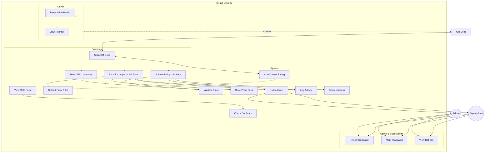

# TriFair — Passenger Use Case Diagram

## Actors

| Actor | Role |
|---|---|
| **Passenger** | Anonymous user na nag-scan ng QR at nag-submit ng rating |
| **Driver** | May QR code na nagte-trigger ng rating flow |
| **Admin** | Tumitingin ng ratings at nagma-mark ng reviewed |
| **Superadmin** | Same as Admin + nagma-manage ng system |

## Use Cases

### Passenger
1. **Scan QR Code** — Mag-scan ng QR code ng driver
2. **View Rate Form** — Makita ang interactive form na may mapa
3. **Select Trip Locations** — Pumili ng start/end location via GPS o map click
4. **Submit Rating (3-5 Stars)** — Magbigay ng positive rating
5. **Submit Complaint (1-2 Stars)** — Mag-ulat ng reklamo na may proofs
6. **Upload Proof Files** — Mag-attach ng photo/video/doc para sa complaint

### System (Auto)
7. **Auto-Create Rating Record** — Gumawa ng placeholder rating kada scan
8. **Validate Input** — I-check ang required fields depende sa rating value
9. **Check Duplicate** — I-prevent ang double rating (same IP + driver + day)
10. **Save Proof Files** — I-store ang uploaded files sa storage
11. **Notify Admin & Superadmin** — Mag-notify kapag may bagong complaint
12. **Log Rating Activity** — I-record sa activity logs
13. **Show Success Message** — I-confirm sa passenger na na-submit ang rating

### Admin / Superadmin
14. **Review Complaint** — Tingnan ang complaints na may proofs
15. **Mark as Reviewed** — I-mark ang complaint bilang reviewed
16. **View All Ratings** — Tingnan ang lahat ng ratings

### Driver
17. **Respond to Rating** — Sumagot sa rating ng passenger
18. **View Received Ratings** — Tingnan ang kanilang ratings at average score

---

## Relationships

```
Passenger ──(scans)──> QR Code ──(triggers)──> Scan QR Code
Scan QR Code <<include>> Auto-Create Rating Record
Auto-Create Rating Record <<extend>> View Rate Form
View Rate Form <<include>> Check Duplicate
Submit Rating <<include>> Validate Input
Submit Complaint <<include>> Upload Proof Files
Submit Complaint <<include>> Save Proof Files
Submit Complaint <<include>> Notify Admin & Superadmin
Submit Complaint <<include>> Log Rating Activity
Notify Admin & Superadmin ──(notifies)──> Admin
Notify Admin & Superadmin ──(notifies)──> Superadmin
Admin ──> Review Complaint
Superadmin ──> Review Complaint
```

---

## Diagram (Mermaid)



---

## Flow Summary

```
QR Scan → Auto-Create Rating → Show Rate Form (with Map)
                                    │
                          Passenger fills form
                                    │
                    ┌───────────────┴───────────────┐
                    │ 3-5 Stars                     │ 1-2 Stars
                    │ (Positive)                    │ (Complaint)
                    │                               │
            Submit Rating                    Submit Complaint
            Validate Input                   + Upload Proof Files
            Log Activity                     + Save Proofs
            Show Success                     + Notify Admins
                                             + Log Activity
                                             + Show Success
```
